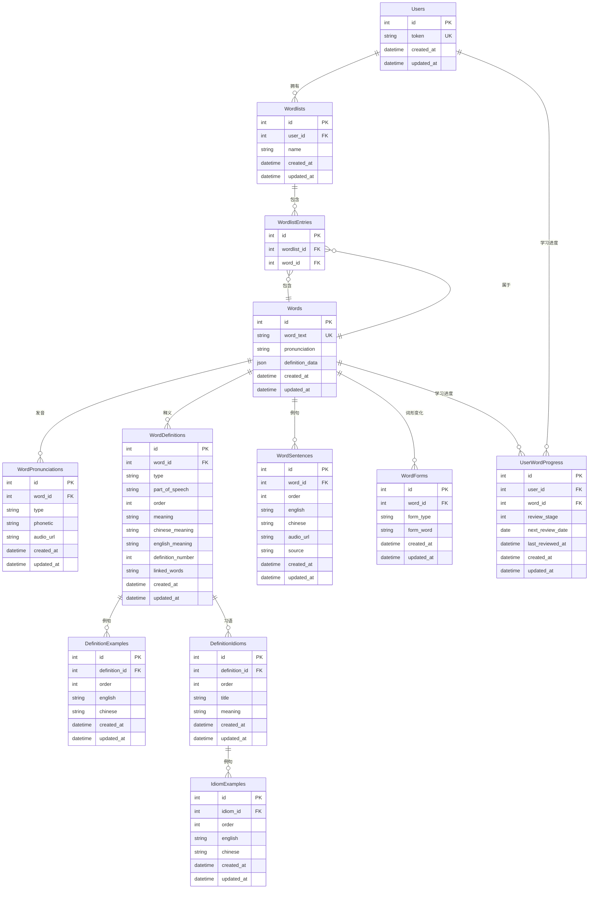

# 数据库关系图

## 新表结构关系图



## 表结构说明

### 主要表关系

1. **用户相关表**
   - `Users`：用户基本信息
   - `Wordlists`：用户创建的词书
   - `UserWordProgress`：用户学习进度

2. **单词相关表**
   - `Words`：单词基本信息（保留原JSON字段）
   - `WordPronunciations`：单词发音（美式/英式）
   - `WordDefinitions`：单词释义（多种类型）
   - `WordSentences`：单词例句
   - `WordForms`：词形变化

3. **释义相关表**
   - `DefinitionExamples`：释义中的例句
   - `DefinitionIdioms`：释义中的习语
   - `IdiomExamples`：习语中的例句

4. **关联表**
   - `WordlistEntries`：词书与单词的多对多关系

### 索引策略

1. **唯一索引**
   - `Words.word_text`
   - `Users.token`
   - `WordPronunciations.word_id + type`
   - `WordForms.word_id + form_type`
   - `WordlistEntries.wordlist_id + word_id`
   - `UserWordProgress.user_id + word_id`

2. **普通索引**
   - `WordDefinitions.word_id + type`
   - `WordSentences.word_id`
   - `DefinitionExamples.definition_id`
   - `DefinitionIdioms.definition_id`
   - `IdiomExamples.idiom_id`

### 查询优化

1. **查询单词基本信息**
   ```sql
   SELECT w.*, p.phonetic, p.audio_url 
   FROM Words w 
   LEFT JOIN WordPronunciations p ON w.id = p.word_id 
   WHERE w.word_text = 'example';
   ```

2. **查询单词释义**
   ```sql
   SELECT d.*, e.english, e.chinese 
   FROM WordDefinitions d 
   LEFT JOIN DefinitionExamples e ON d.id = e.definition_id 
   WHERE d.word_id = ? AND d.type = 'authoritative';
   ```

3. **查询单词例句**
   ```sql
   SELECT english, chinese, audio_url, source 
   FROM WordSentences 
   WHERE word_id = ? 
   ORDER BY order;
   ```

### 数据迁移流程

```mermaid
flowchart TD
    A[开始] --> B[创建新表结构]
    B --> C[解析现有JSON数据]
    C --> D[插入到新表结构]
    D --> E[验证数据完整性]
    E --> F{数据验证通过?}
    F -->|是| G[更新API代码]
    F -->|否| H[修复数据问题]
    H --> D
    G --> I[测试API功能]
    I --> J{功能测试通过?}
    J -->|是| K[部署到生产环境]
    J -->|否| L[修复API问题]
    L --> I
    K --> M[监控运行状态]
    M --> N[完成]