# 词书上传到显示流程分析

## 概述

本文档详细分析了从用户上传词书到前端显示的完整流程，包括词书上传、数据库存储、学习界面数据获取和缓存机制等关键环节。该流程是A4 Recite应用的核心功能，涉及前端组件、后端API、数据库操作和缓存策略等多个技术层面。

## 完整流程图

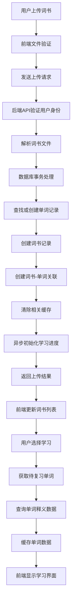
```mermaid
flowchart TD
    A[用户上传词书] --> B[前端文件验证]
    B --> C[发送上传请求]
    C --> D[后端API验证用户身份]
    D --> E[解析词书文件]
    E --> F[数据库事务处理]
    F --> G[查找或创建单词记录]
    G --> H[创建词书记录]
    H --> I[创建词书-单词关联]
    I --> J[清除相关缓存]
    J --> K[异步初始化学习进度]
    K --> L[返回上传结果]
    L --> M[前端更新词书列表]
    M --> N[用户选择学习]
    N --> O[获取待复习单词]
    O --> P[查询单词释义数据]
    P --> Q[缓存单词数据]
    Q --> R[前端显示学习界面]
```

## 详细流程分析

### 词书上传流程（前端到后端）

#### 1. 前端上传流程

**组件位置**: [`src/components/dashboard/WordlistsCard.tsx`](src/components/dashboard/WordlistsCard.tsx)

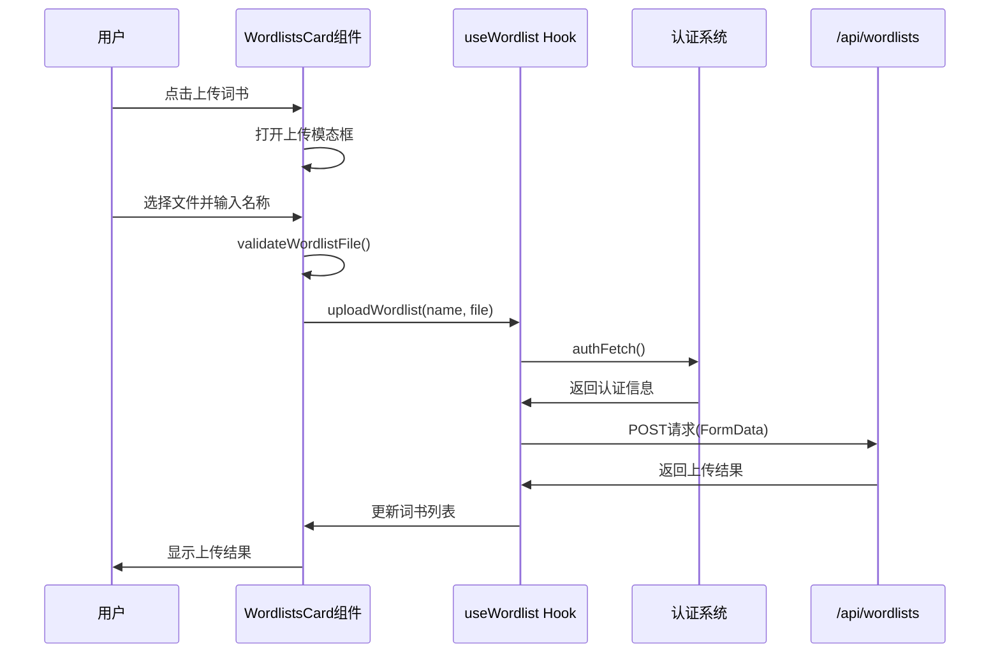
```mermaid
sequenceDiagram
    participant U as 用户
    participant C as WordlistsCard组件
    participant H as useWordlist Hook
    participant A as 认证系统
    participant API as /api/wordlists
    
    U->>C: 点击上传词书
    C->>C: 打开上传模态框
    U->>C: 选择文件并输入名称
    C->>C: validateWordlistFile()
    C->>H: uploadWordlist(name, file)
    H->>A: authFetch()
    A->>H: 返回认证信息
    H->>API: POST请求(FormData)
    API->>H: 返回上传结果
    H->>C: 更新词书列表
    C->>U: 显示上传结果
```

**关键步骤**:
1. **文件验证**: [`validateWordlistFile()`](src/hooks/useWordlist.ts:163) 验证文件类型和大小
2. **文件解析**: [`parseWordlistFile()`](src/hooks/useWordlist.ts:186) 解析文件内容并提取单词
3. **认证处理**: [`authFetch()`](src/hooks/useAuth.ts) 确保用户身份验证
4. **缓存清理**: 上传成功后清除相关缓存

#### 2. 后端处理流程

**API路由**: [`src/app/api/wordlists/route.ts`](src/app/api/wordlists/route.ts)

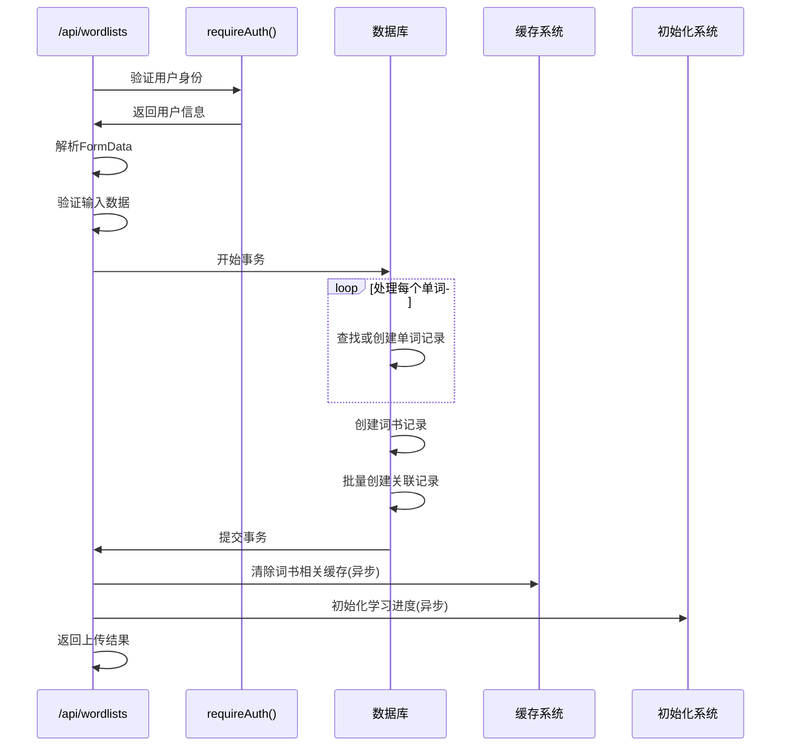
```mermaid
sequenceDiagram
    participant API as /api/wordlists
    participant Auth as requireAuth()
    participant DB as 数据库
    participant Cache as 缓存系统
    participant Init as 初始化系统
    
    API->>Auth: 验证用户身份
    Auth->>API: 返回用户信息
    API->>API: 解析FormData
    API->>API: 验证输入数据
    API->>DB: 开始事务
    loop 处理每个单词
        DB->>DB: 查找或创建单词记录
    end
    DB->>DB: 创建词书记录
    DB->>DB: 批量创建关联记录
    DB->>API: 提交事务
    API->>Cache: 清除词书相关缓存(异步)
    API->>Init: 初始化学习进度(异步)
    API->>API: 返回上传结果
```

**关键处理逻辑**:
1. **身份验证**: [`requireAuth()`](src/lib/auth.ts) 验证用户token
2. **事务处理**: 使用数据库事务确保数据一致性
3. **单词去重**: 自动处理重复单词，避免重复创建
4. **异步操作**: 缓存清理和进度初始化不阻塞响应

### 数据库存储流程

#### 1. 数据库表结构

**核心表关系** (详见 [`prisma/schema.prisma`](prisma/schema.prisma)):

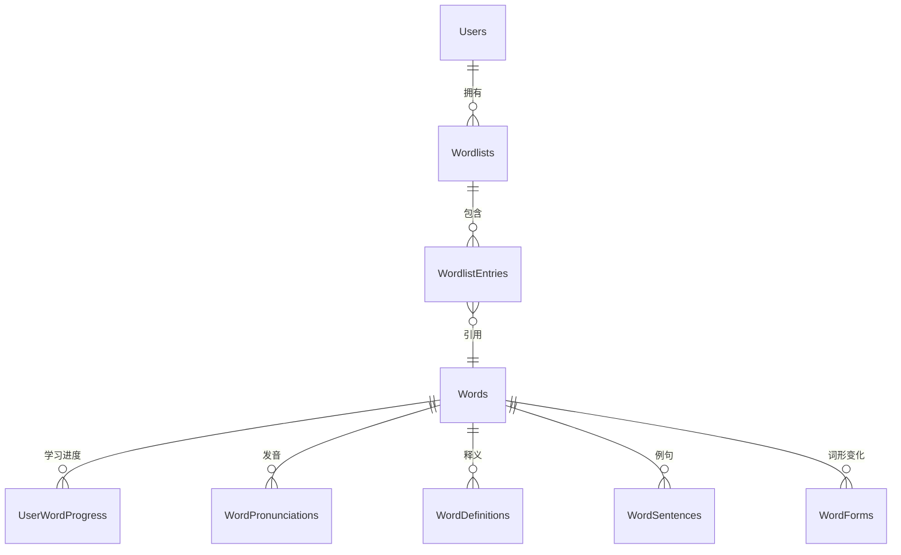
```mermaid
erDiagram
    Users ||--o{ Wordlists : "拥有"
    Wordlists ||--o{ WordlistEntries : "包含"
    WordlistEntries }o--|| Words : "引用"
    Words ||--o{ UserWordProgress : "学习进度"
    Words ||--o{ WordPronunciations : "发音"
    Words ||--o{ WordDefinitions : "释义"
    Words ||--o{ WordSentences : "例句"
    Words ||--o{ WordForms : "词形变化"
```

#### 2. 数据存储流程

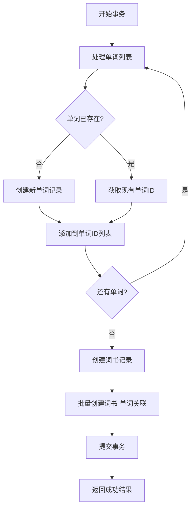
```mermaid
flowchart TD
    A[开始事务] --> B[处理单词列表]
    B --> C{单词已存在?}
    C -->|否| D[创建新单词记录]
    C -->|是| E[获取现有单词ID]
    D --> F[添加到单词ID列表]
    E --> F
    F --> G{还有单词?}
    G -->|是| B
    G -->|否| H[创建词书记录]
    H --> I[批量创建词书-单词关联]
    I --> J[提交事务]
    J --> K[返回成功结果]
```

**关键特性**:
- **事务一致性**: 所有操作在同一事务中完成
- **级联删除**: 删除词书时自动清理相关数据
- **唯一约束**: 防止重复单词和重复关联

### 学习界面数据获取流程

#### 1. 学习会话初始化

**Hook位置**: [`src/hooks/useLearning.ts`](src/hooks/useLearning.ts)

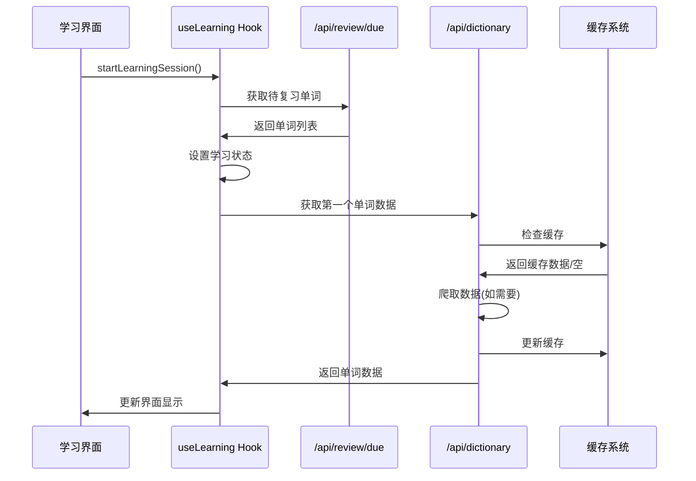
```mermaid
sequenceDiagram
    participant UI as 学习界面
    participant Hook as useLearning Hook
    participant API as /api/review/due
    participant DictAPI as /api/dictionary
    participant Cache as 缓存系统
    
    UI->>Hook: startLearningSession()
    Hook->>API: 获取待复习单词
    API->>Hook: 返回单词列表
    Hook->>Hook: 设置学习状态
    Hook->>DictAPI: 获取第一个单词数据
    DictAPI->>Cache: 检查缓存
    Cache->>DictAPI: 返回缓存数据/空
    DictAPI->>DictAPI: 爬取数据(如需要)
    DictAPI->>Cache: 更新缓存
    DictAPI->>Hook: 返回单词数据
    Hook->>UI: 更新界面显示
```

#### 2. 单词数据获取流程

**API路由**: [`src/app/api/dictionary/route.ts`](src/app/api/dictionary/route.ts)

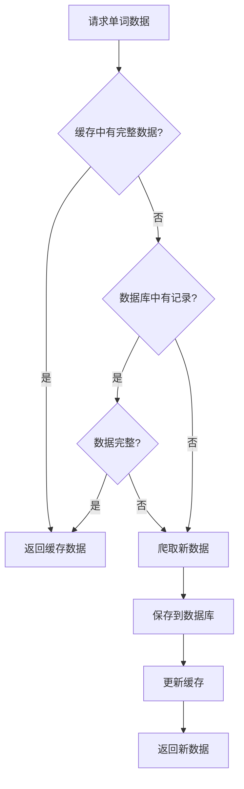
```mermaid
flowchart TD
    A[请求单词数据] --> B{缓存中有完整数据?}
    B -->|是| C[返回缓存数据]
    B -->|否| D{数据库中有记录?}
    D -->|是| E{数据完整?}
    D -->|否| F[爬取新数据]
    E -->|是| C
    E -->|否| F
    F --> G[保存到数据库]
    G --> H[更新缓存]
    H --> I[返回新数据]
```

**数据获取优先级**:
1. **新表结构**: 优先从结构化表查询
2. **JSON缓存**: 作为后备数据源
3. **网络爬取**: 当本地没有数据时触发
4. **数据验证**: 确保返回数据的完整性

### 缓存机制工作流程

#### 1. 多层缓存架构

**缓存实现**: [`src/lib/cacheUtils.ts`](src/lib/cacheUtils.ts)

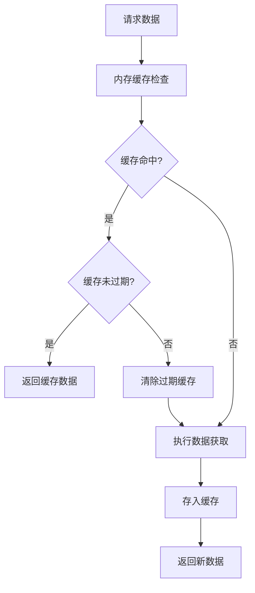
```mermaid
flowchart TD
    A[请求数据] --> B[内存缓存检查]
    B --> C{缓存命中?}
    C -->|是| D{缓存未过期?}
    C -->|否| E[执行数据获取]
    D -->|是| F[返回缓存数据]
    D -->|否| G[清除过期缓存]
    G --> E
    E --> H[存入缓存]
    H --> I[返回新数据]
```

#### 2. 缓存策略

**缓存类型**:
- **内存缓存**: 单词数据缓存(5分钟TTL)
- **API响应缓存**: 词书列表、待复习单词等(2-5分钟TTL)
- **预加载缓存**: 提前获取后续单词数据

**缓存键策略**:
```typescript
// 词书列表
'wordlists'

// 待复习单词
`dueWords:${wordlistId}:${limit}:${isNewMode}`

// 单词数据
`${wordlistId || 'global'}:${wordText}`

// 学习进度统计
`learningProgressStats:${wordlistId}`
```

## 关键组件分析

### 前端组件及其职责

#### 1. 词书管理组件

| 组件 | 位置 | 职责 |
|------|------|------|
| [`WordlistsCard`](src/components/dashboard/WordlistsCard.tsx) | 词书管理主界面 | 显示词书列表、处理上传/删除操作 |
| [`UploadWordlistModal`](src/components/dashboard/WordlistsCard.tsx:66) | 上传模态框 | 文件选择、验证、上传表单处理 |
| [`WordlistItem`](src/components/dashboard/WordlistsCard.tsx:11) | 词书项组件 | 单个词书的显示和操作按钮 |

#### 2. 学习界面组件

| 组件 | 位置 | 职责 |
|------|------|------|
| [`FocusLearningPage`](src/app/learning/focus/page.tsx) | 学习主页面 | 整合所有学习组件，管理学习状态 |
| [`WordCard`](src/app/learning/focus/components/word-cards/WordCard.tsx) | 单词卡片 | 显示单词内容，处理用户交互 |
| [`DefinitionPanel`](src/app/learning/focus/components/definition-panel/DefinitionPanel.tsx) | 释义面板 | 显示单词详细释义和例句 |

#### 3. 数据管理Hooks

| Hook | 位置 | 职责 |
|------|------|------|
| [`useWordlist`](src/hooks/useWordlist.ts) | 词书数据管理 | 词书CRUD操作、缓存管理 |
| [`useLearning`](src/hooks/useLearning.ts) | 学习状态管理 | 学习会话控制、单词数据获取 |
| [`useAuth`](src/hooks/useAuth.ts) | 身份验证 | 用户认证、token管理 |

### 后端API及其功能

#### 1. 词书管理API

| 端点 | 方法 | 功能 | 关键实现 |
|------|------|------|----------|
| [`/api/wordlists`](src/app/api/wordlists/route.ts) | GET | 获取用户词书列表 | 缓存优化、计数统计 |
| [`/api/wordlists`](src/app/api/wordlists/route.ts:95) | POST | 上传新词书 | 事务处理、异步初始化 |
| [`/api/wordlists/[id]`](src/app/api/wordlists/[id]/route.ts) | DELETE | 删除词书 | 级联删除、缓存清理 |

#### 2. 学习相关API

| 端点 | 方法 | 功能 | 关键实现 |
|------|------|------|----------|
| [`/api/learning/initialize`](src/app/api/learning/initialize/route.ts) | POST | 初始化学习进度 | 批量创建、重复检查 |
| [`/api/review/due`](src/app/api/review/due/route.ts) | GET | 获取待复习单词 | 复习算法、优先级排序 |
| [`/api/dictionary`](src/app/api/dictionary/route.ts) | GET | 获取单词释义 | 多层缓存、数据爬取 |

#### 3. 数据处理逻辑

**词书上传处理**:
```typescript
// 事务处理确保数据一致性
const result = await db.$transaction(async (tx) => {
  // 查找或创建单词记录
  for (const wordText of uniqueWords) {
    let word = await tx.word.findUnique({ where: { wordText } });
    if (!word) {
      word = await tx.word.create({ data: { wordText } });
    }
    wordIds.push(word.id);
  }
  
  // 创建词书记录
  const newWordlist = await tx.wordlist.create({
    data: { userId, name: name.trim() }
  });
  
  // 批量创建关联记录
  await tx.wordlistEntry.createMany({
    data: wordIds.map(wordId => ({
      wordlistId: newWordlist.id,
      wordId
    }))
  });
  
  return { id: newWordlist.id, name: newWordlist.name };
});
```

### 数据库表及其关系

#### 1. 核心表结构

| 表名 | 用途 | 关键字段 | 关系 |
|------|------|----------|------|
| `Users` | 用户信息 | `id`, `token` | 一对多词书 |
| `Wordlists` | 词书信息 | `id`, `userId`, `name` | 属于用户 |
| `Words` | 单词基础信息 | `id`, `wordText`, `definitionData` | 多对多词书 |
| `WordlistEntries` | 词书-单词关联 | `wordlistId`, `wordId` | 连接表 |
| `UserWordProgress` | 学习进度 | `userId`, `wordId`, `reviewStage` | 用户-单词 |

#### 2. 单词详情表

| 表名 | 用途 | 关键字段 | 关系 |
|------|------|----------|------|
| `WordPronunciations` | 发音数据 | `wordId`, `type`, `phonetic` | 属于单词 |
| `WordDefinitions` | 释义数据 | `wordId`, `type`, `meaning` | 属于单词 |
| `DefinitionExamples` | 释义例句 | `definitionId`, `english` | 属于释义 |
| `WordSentences` | 单词例句 | `wordId`, `english`, `chinese` | 属于单词 |
| `WordForms` | 词形变化 | `wordId`, `formType`, `formWord` | 属于单词 |

#### 3. 数据库演进

**第一阶段** (2025-10-15): 基础表结构
- 创建核心5张表
- 使用JSON字段存储完整单词数据

**第二阶段** (2025-10-16): 结构化数据扩展
- 新增7张详细表
- 保留JSON字段作为备份
- 实现双向数据转换

### 缓存层及其策略

#### 1. 内存缓存实现

**类**: [`MemoryCache`](src/lib/cacheUtils.ts:8)

```typescript
class MemoryCache {
  private cache = new Map<string, CacheItem<unknown>>();
  
  set<T>(key: string, data: T, ttl: number = 5 * 60 * 1000): void
  get<T>(key: string): T | null
  delete(key: string): boolean
  cleanup(): void
}
```

#### 2. 缓存策略

**缓存层级**:
1. **L1 - 内存缓存**: 最快访问，短期存储
2. **L2 - 数据库缓存**: 中期存储，结构化数据
3. **L3 - 网络数据**: 最慢，但最完整

**缓存失效策略**:
- **TTL过期**: 自动过期清理
- **主动清除**: 数据更新时清理
- **版本控制**: 缓存键版本管理

**预加载策略**:
```typescript
// 预加载后续5个单词
const preloadNextWords = useCallback(async (wordlistId, wordQueue, currentIndex) => {
  for (let i = 1; i <= 5; i++) {
    const nextIndex = currentIndex + i;
    if (nextIndex < wordQueue.length) {
      const wordText = wordQueue[nextIndex];
      if (!isCacheValid(wordlistId, wordText)) {
        // 添加到预加载队列
        preloadQueue.current.push({
          wordText,
          priority: i,
          retryCount: 0
        });
      }
    }
  }
}, []);
```

## 数据流转图

### 完整数据流转

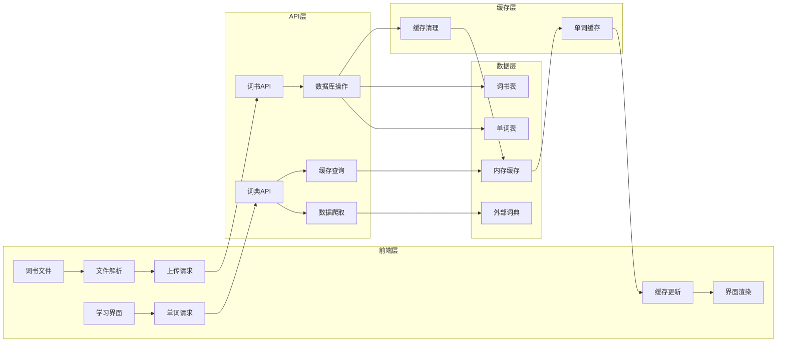
```mermaid
flowchart LR
    subgraph "前端层"
        A[词书文件] --> B[文件解析]
        B --> C[上传请求]
        D[学习界面] --> E[单词请求]
        F[缓存更新] --> G[界面渲染]
    end
    
    subgraph "API层"
        C --> H[词书API]
        E --> I[词典API]
        H --> J[数据库操作]
        I --> K[缓存查询]
        I --> L[数据爬取]
    end
    
    subgraph "数据层"
        J --> M[词书表]
        J --> N[单词表]
        K --> O[内存缓存]
        L --> P[外部词典]
    end
    
    subgraph "缓存层"
        O --> Q[单词缓存]
        Q --> F
        J --> R[缓存清理]
        R --> O
    end
```

### 单词数据流转

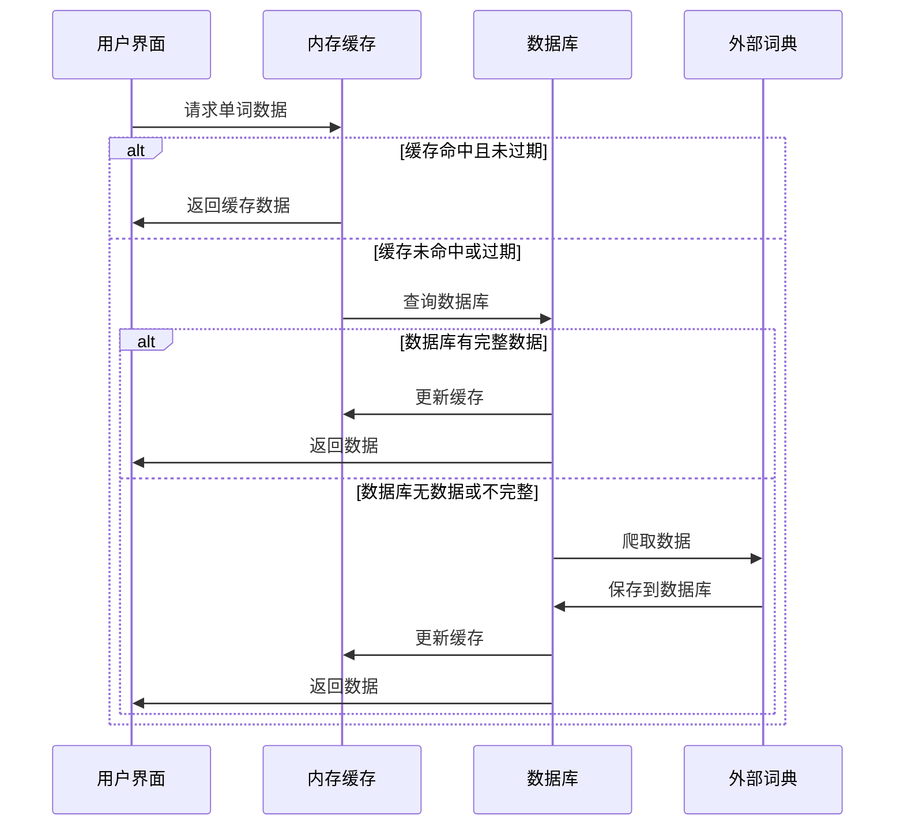
```mermaid
sequenceDiagram
    participant UI as 用户界面
    participant Cache as 内存缓存
    participant DB as 数据库
    participant Web as 外部词典
    
    UI->>Cache: 请求单词数据
    alt 缓存命中且未过期
        Cache->>UI: 返回缓存数据
    else 缓存未命中或过期
        Cache->>DB: 查询数据库
        alt 数据库有完整数据
            DB->>Cache: 更新缓存
            DB->>UI: 返回数据
        else 数据库无数据或不完整
            DB->>Web: 爬取数据
            Web->>DB: 保存到数据库
            DB->>Cache: 更新缓存
            DB->>UI: 返回数据
        end
    end
```

## 时序图

### 词书上传时序

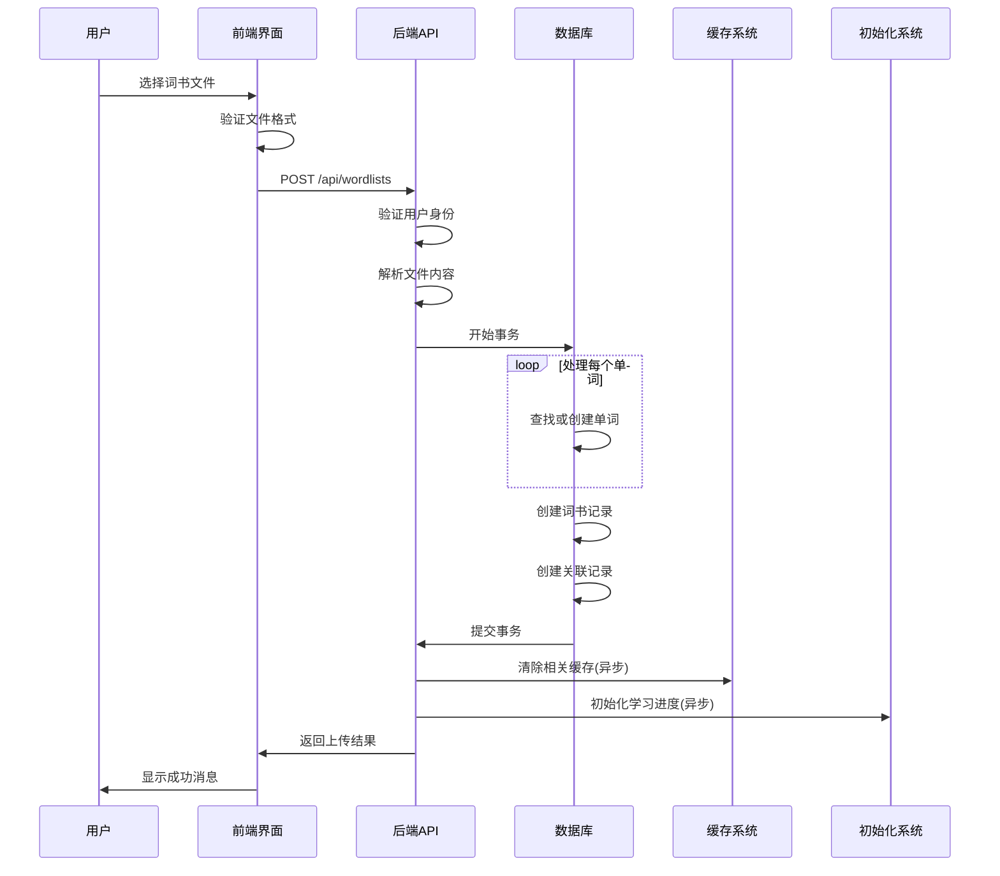
```mermaid
sequenceDiagram
    participant User as 用户
    participant UI as 前端界面
    participant API as 后端API
    participant DB as 数据库
    participant Cache as 缓存系统
    participant Init as 初始化系统
    
    User->>UI: 选择词书文件
    UI->>UI: 验证文件格式
    UI->>API: POST /api/wordlists
    API->>API: 验证用户身份
    API->>API: 解析文件内容
    API->>DB: 开始事务
    loop 处理每个单词
        DB->>DB: 查找或创建单词
    end
    DB->>DB: 创建词书记录
    DB->>DB: 创建关联记录
    DB->>API: 提交事务
    API->>Cache: 清除相关缓存(异步)
    API->>Init: 初始化学习进度(异步)
    API->>UI: 返回上传结果
    UI->>User: 显示成功消息
```

### 学习会话时序

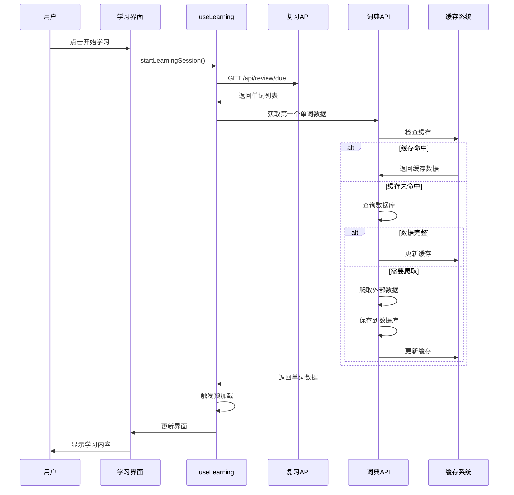
```mermaid
sequenceDiagram
    participant User as 用户
    participant UI as 学习界面
    participant Hook as useLearning
    participant API as 复习API
    participant DictAPI as 词典API
    participant Cache as 缓存系统
    
    User->>UI: 点击开始学习
    UI->>Hook: startLearningSession()
    Hook->>API: GET /api/review/due
    API->>Hook: 返回单词列表
    Hook->>DictAPI: 获取第一个单词数据
    DictAPI->>Cache: 检查缓存
    alt 缓存命中
        Cache->>DictAPI: 返回缓存数据
    else 缓存未命中
        DictAPI->>DictAPI: 查询数据库
        alt 数据完整
            DictAPI->>Cache: 更新缓存
        else 需要爬取
            DictAPI->>DictAPI: 爬取外部数据
            DictAPI->>DictAPI: 保存到数据库
            DictAPI->>Cache: 更新缓存
        end
    end
    DictAPI->>Hook: 返回单词数据
    Hook->>Hook: 触发预加载
    Hook->>UI: 更新界面
    UI->>User: 显示学习内容
```

## 潜在问题点

### 1. 词书上传环节

| 问题点 | 可能原因 | 影响 | 解决方案 |
|--------|----------|------|----------|
| 文件格式不支持 | 用户上传错误格式 | 上传失败 | 前端严格验证，提供示例文件 |
| 大文件上传超时 | 文件过大或网络慢 | 用户体验差 | 文件大小限制，进度显示 |
| 重复单词处理 | 词书包含重复单词 | 数据冗余 | 自动去重，提示用户 |
| 事务回滚 | 数据库约束冲突 | 上传失败 | 详细错误日志，用户友好提示 |

### 2. 数据存储环节

| 问题点 | 可能原因 | 影响 | 解决方案 |
|--------|----------|------|----------|
| 外键约束失败 | 关联数据不存在 | 数据不一致 | 严格的事务处理 |
| 索引性能问题 | 大量数据查询 | 响应慢 | 优化索引策略 |
| 存储空间不足 | 大量释义数据 | 系统不可用 | 数据清理策略 |
| 并发写入冲突 | 多用户同时操作 | 数据丢失 | 乐观锁机制 |

### 3. 学习界面环节

| 问题点 | 可能原因 | 影响 | 解决方案 |
|--------|----------|------|----------|
| 单词数据加载慢 | 缓存未命中或网络问题 | 学习体验差 | 预加载机制，加载状态显示 |
| 释义数据不完整 | 爬虫失败或数据源变化 | 学习内容缺失 | 多数据源，数据验证 |
| 缓存数据过期 | TTL设置不合理 | 显示旧数据 | 智能缓存策略 |
| 学习进度不同步 | 多设备学习 | 进度丢失 | 实时同步机制 |

### 4. 缓存机制环节

| 问题点 | 可能原因 | 影响 | 解决方案 |
|--------|----------|------|----------|
| 缓存雪崩 | 大量缓存同时过期 | 系统负载高 | 随机TTL，缓存预热 |
| 缓存穿透 | 查询不存在的数据 | 无效请求 | 缓存空值，布隆过滤器 |
| 内存泄漏 | 缓存未正确清理 | 系统崩溃 | 定期清理，内存监控 |
| 缓存不一致 | 更新操作失败 | 数据错误 | 事务性更新，版本控制 |

### 5. 网络爬取环节

| 问题点 | 可能原因 | 影响 | 解决方案 |
|--------|----------|------|----------|
| 网站结构变化 | 目标网站改版 | 爬取失败 | 多选择器，结构检测 |
| 请求频率限制 | 反爬虫机制 | IP被封 | 请求限流，代理池 |
| 数据格式变化 | HTML结构改变 | 解析错误 | 容错解析，数据验证 |
| 网络超时 | 网络问题 | 请求失败 | 重试机制，超时设置 |

## 八、待复习单词逻辑深度分析

### 1. 待复习单词的存储和计算逻辑

#### 1.1 数据库存储结构

待复习单词的核心数据存储在 [`UserWordProgress`](prisma/schema.prisma:227) 表中：

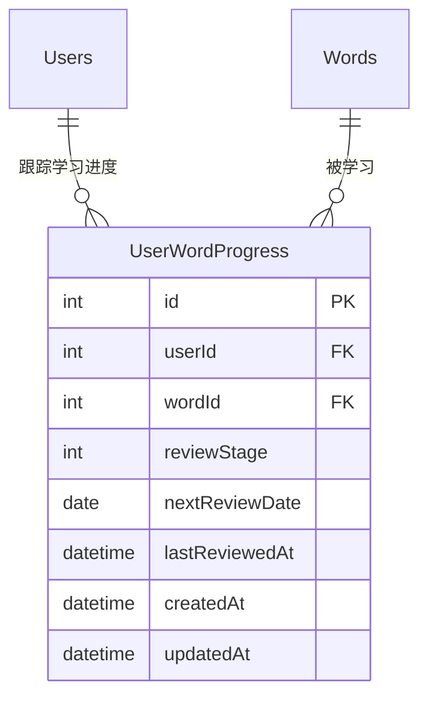
```mermaid
erDiagram
    Users ||--o{ UserWordProgress : "跟踪学习进度"
    Words ||--o{ UserWordProgress : "被学习"
    UserWordProgress {
        int id PK
        int userId FK
        int wordId FK
        int reviewStage
        date nextReviewDate
        datetime lastReviewedAt
        datetime createdAt
        datetime updatedAt
    }
```

**关键字段说明**：
- `reviewStage`: 复习阶段（0-8），0表示新单词，1-8表示不同的复习间隔
- `nextReviewDate`: 下次复习日期，基于艾宾浩斯遗忘曲线计算
- `lastReviewedAt`: 最后复习时间，用于审计和调试

#### 1.2 待复习单词计算逻辑

待复习单词的计算在 [`/api/review/due`](src/app/api/review/due/route.ts) API中实现：

```typescript
// 核心查询条件
const whereCondition = {
  userId: user.id,
  nextReviewDate: {
    lte: new Date() // 小于或等于今天的日期
  }
};
```

**计算流程**：

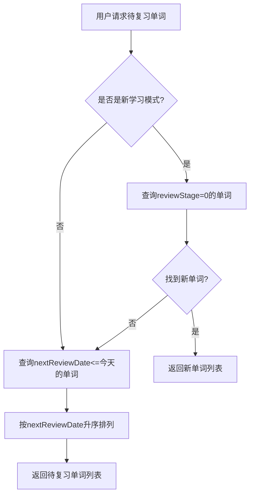
```mermaid
flowchart TD
    A[用户请求待复习单词] --> B{是否是新学习模式?}
    B -->|是| C[查询reviewStage=0的单词]
    B -->|否| D[查询nextReviewDate<=今天的单词]
    C --> E{找到新单词?}
    E -->|是| F[返回新单词列表]
    E -->|否| D
    D --> G[按nextReviewDate升序排列]
    G --> H[返回待复习单词列表]
```

**新学习模式优先级**：
1. 优先返回 `reviewStage = 0` 的新单词
2. 如果没有新单词，返回需要复习的单词
3. 新单词按创建时间升序排列（先创建先学习）
4. 复习单词按 `nextReviewDate` 升序排列（过期时间长的优先）

#### 1.3 复习间隔计算

复习间隔基于艾宾浩斯遗忘曲线，在 [`/api/review/progress/[wordId]`](src/app/api/review/progress/[wordId]/route.ts) 中实现：

```typescript
// 正确回答后的处理
if (isCorrect) {
  newReviewStage = Math.min(userWordProgress.reviewStage + 1, 8);
  const intervalDays = EBBINGHAUS_INTERVAL_MAP[newReviewStage] || 120;
  nextReviewDate.setDate(nextReviewDate.getDate() + intervalDays);
} else {
  // 错误回答重置到第0阶段
  newReviewStage = 0;
  nextReviewDate = new Date();
}
```

### 2. 学习进度更新机制的详细分析

#### 2.1 进度更新流程

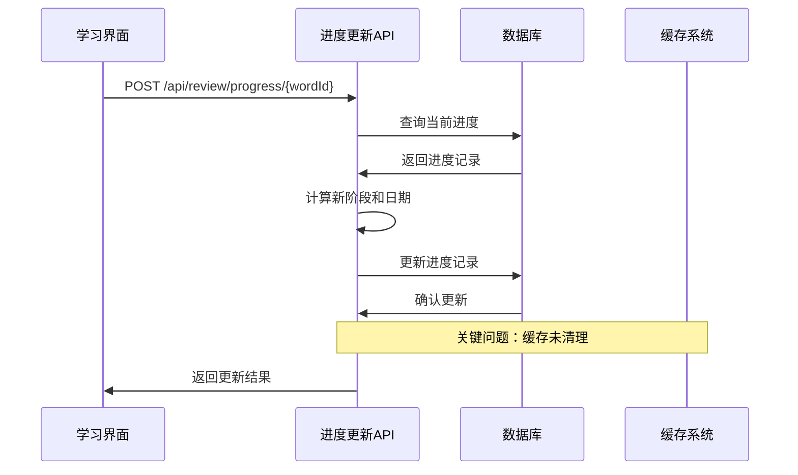
```mermaid
sequenceDiagram
    participant UI as 学习界面
    participant API as 进度更新API
    participant DB as 数据库
    participant Cache as 缓存系统
    
    UI->>API: POST /api/review/progress/{wordId}
    API->>DB: 查询当前进度
    DB->>API: 返回进度记录
    API->>API: 计算新阶段和日期
    API->>DB: 更新进度记录
    DB->>API: 确认更新
    Note over API,Cache: 关键问题：缓存未清理
    API->>UI: 返回更新结果
```

#### 2.2 进度更新的关键问题

**问题1：缓存未及时清理**

```typescript
// 在 /api/review/progress/[wordId]/route.ts 中
// 更新数据库后，没有清理相关缓存
await db.userWordProgress.update({
  where: { userId_wordId: { userId: user.id, wordId: wordIdNum } },
  data: {
    reviewStage: newReviewStage,
    nextReviewDate: nextReviewDate,
    lastReviewedAt: new Date()
  }
});
// 缺少缓存清理逻辑！
```

**问题2：时间精度问题**

```typescript
// 当前实现使用日期比较，可能存在时区问题
nextReviewDate: {
  lte: new Date() // 使用服务器当前时间
}
```

**问题3：学习会话状态与服务器状态不同步**

```typescript
// 在 useLearning.ts 中
const updateWordProgress = useCallback(async (wordId: number, isCorrect: boolean) => {
  // 更新服务器状态
  const response = await authFetch(`/api/review/progress/${wordId}`, {
    method: 'POST',
    body: JSON.stringify({ isCorrect })
  });
  
  // 但没有更新本地状态，导致不一致
  // 本地 wordQueue 仍然包含已复习的单词
}, []);
```

### 3. 复习完成单词仍显示待复习的根本原因

#### 3.1 缓存不一致问题

**根本原因**：单词复习完成后，相关缓存没有被及时清理，导致前端仍然显示旧的待复习单词列表。

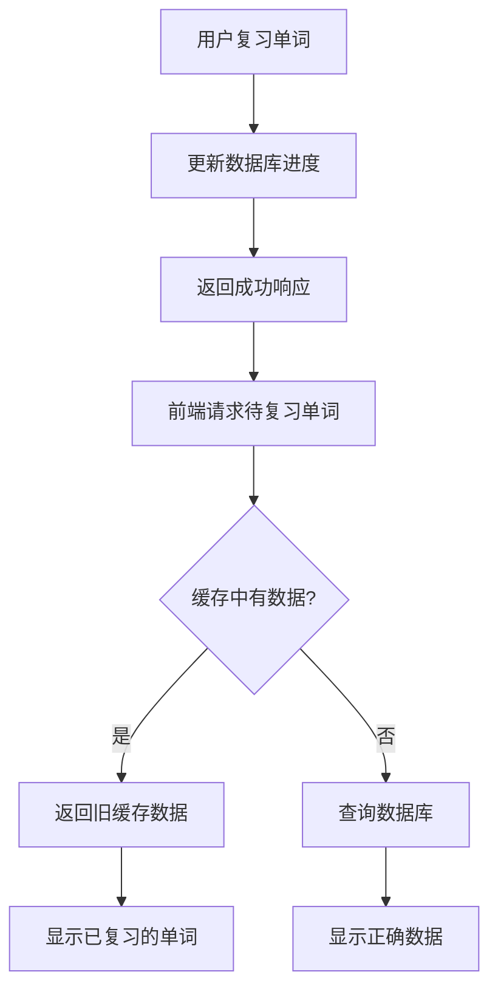
```mermaid
flowchart TD
    A[用户复习单词] --> B[更新数据库进度]
    B --> C[返回成功响应]
    C --> D[前端请求待复习单词]
    D --> E{缓存中有数据?}
    E -->|是| F[返回旧缓存数据]
    E -->|否| G[查询数据库]
    F --> H[显示已复习的单词]
    G --> I[显示正确数据]
```

#### 3.2 缓存键不匹配问题

在 [`src/lib/cacheUtils.ts`](src/lib/cacheUtils.ts) 中，缓存键生成存在不一致：

```typescript
// 缓存清理时的键
const dueWordsKeys = [
  generateCacheKey('dueWords', { wordlistId, limit: 50, isNewMode: false }),
  generateCacheKey('dueWords', { wordlistId, limit: 50, isNewMode: true }),
  // ... 其他固定组合
];

// 但实际请求时可能使用不同的limit参数
const url = '/api/review/due?limit=' + limit; // limit可能是任意值
```

#### 3.3 学习会话状态管理问题

在 [`src/hooks/useLearning.ts`](src/hooks/useLearning.ts) 中，学习会话状态没有正确更新：

```typescript
const nextWord = useCallback((): boolean => {
  // 只是移动到下一个单词，但没有从队列中移除已完成的单词
  const nextIndex = learningState.currentIndex + 1;
  const nextWordText = learningState.wordQueue[nextIndex];
  
  setLearningState(prev => ({
    ...prev,
    currentIndex: nextIndex,
    currentWordText: nextWordText,
    currentWordData: nextWordData
  }));
  
  // 问题：wordQueue 没有更新，已复习的单词仍在队列中
}, []);
```

### 4. 数据一致性问题分析

#### 4.1 数据库与缓存不一致

**问题表现**：
- 数据库中单词已标记为已复习
- 缓存中仍显示为待复习
- 前端显示错误的学习进度

**根本原因**：
1. 更新操作没有触发缓存清理
2. 缓存TTL设置过长
3. 缓存键生成策略不统一

#### 4.2 多个学习会话之间的冲突

**问题场景**：
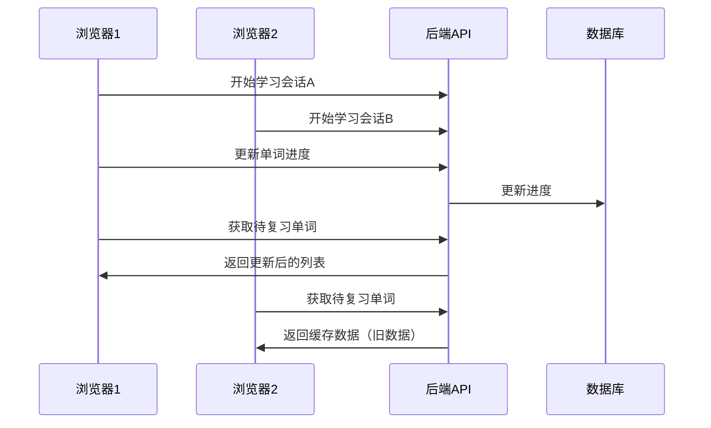
```mermaid
sequenceDiagram
    participant Browser1 as 浏览器1
    participant Browser2 as 浏览器2
    participant API as 后端API
    participant DB as 数据库
    
    Browser1->>API: 开始学习会话A
    Browser2->>API: 开始学习会话B
    Browser1->>API: 更新单词进度
    API->>DB: 更新进度
    Browser1->>API: 获取待复习单词
    API->>Browser1: 返回更新后的列表
    Browser2->>API: 获取待复习单词
    API->>Browser2: 返回缓存数据（旧数据）
```

#### 4.3 时间计算精度问题

**问题代码**：
```typescript
// 在 /api/review/due/route.ts 中
nextReviewDate: {
  lte: new Date() // 可能存在时区和精度问题
}
```

**潜在问题**：
1. 服务器时区与用户时区不一致
2. 毫秒级精度可能导致边界情况
3. 数据库存储的是日期（不包含时间），但比较使用的是日期时间

### 5. 缓存对进度更新的影响

#### 5.1 缓存层次结构

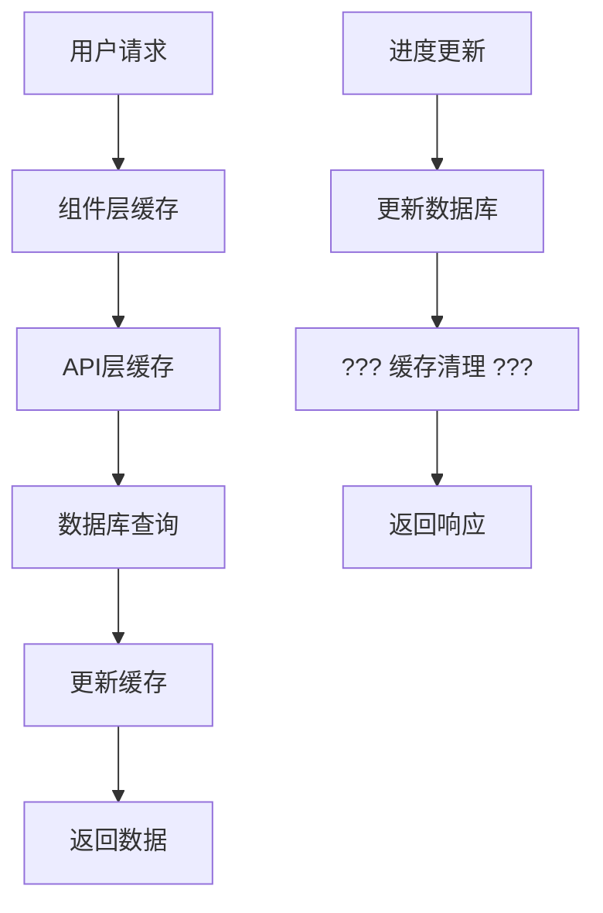
```mermaid
flowchart TD
    A[用户请求] --> B[组件层缓存]
    B --> C[API层缓存]
    C --> D[数据库查询]
    D --> E[更新缓存]
    E --> F[返回数据]
    
    G[进度更新] --> H[更新数据库]
    H --> I[??? 缓存清理 ???]
    I --> J[返回响应]
```

#### 5.2 缓存失效策略缺陷

**当前实现问题**：

1. **被动失效**：依赖TTL自动过期，而不是主动清理
2. **不完整清理**：只清理部分缓存键，遗漏其他参数组合
3. **时序问题**：缓存清理是异步的，可能在清理完成前就有新请求

**改进策略**：

```typescript
// 理想的实现
async function updateWordProgress(wordId: number, isCorrect: boolean) {
  // 1. 更新数据库
  await db.userWordProgress.update({...});
  
  // 2. 同步清理所有相关缓存
  await clearAllRelatedCaches(wordId);
  
  // 3. 返回更新结果
  return { success: true };
}

async function clearAllRelatedCaches(wordId: number) {
  // 获取单词所属的所有词书
  const wordlists = await getWordlistsForWord(wordId);
  
  // 清理每个词书的相关缓存
  for (const wordlistId of wordlists) {
    // 使用模式匹配清理所有可能的缓存键
    memoryCache.deletePattern(`dueWords:${wordlistId}:*`);
    memoryCache.deletePattern(`learningProgressStats:${wordlistId}:*`);
  }
}
```

#### 5.3 缓存键设计问题

**当前问题**：
```typescript
// 生成缓存键时可能存在的差异
generateCacheKey('dueWords', { wordlistId, limit, isNewMode });
// 实际使用时
generateCacheKey('dueWords', { wordlistId: undefined, limit, isNewMode });
// 这两个可能生成不同的键
```

**解决方案**：
```typescript
// 标准化参数生成缓存键
function normalizeCacheParams(params: Record<string, any>): Record<string, any> {
  const normalized: Record<string, any> = {};
  
  for (const [key, value] of Object.entries(params)) {
    if (value === undefined || value === null) {
      continue; // 跳过undefined/null值
    }
    normalized[key] = value;
  }
  
  return normalized;
}

function generateCacheKey(prefix: string, params: Record<string, unknown>): string {
  const normalizedParams = normalizeCacheParams(params);
  const sortedParams = Object.keys(normalizedParams)
    .sort()
    .map(key => `${key}:${normalizedParams[key]}`)
    .join('|');
  return `${prefix}:${sortedParams}`;
}
```

### 6. 综合解决方案

#### 6.1 短期解决方案（立即实施）

1. **在进度更新API中添加缓存清理**：

```typescript
// 修改 /api/review/progress/[wordId]/route.ts
import { clearWordlistRelatedCaches } from '@/lib/cacheUtils';

export async function POST(request: NextRequest, { params }: { params: Promise<{ wordId: string }> }) {
  // ... 现有代码 ...
  
  // 更新学习进度
  await db.userWordProgress.update({
    where: { userId_wordId: { userId: user.id, wordId: wordIdNum } },
    data: {
      reviewStage: newReviewStage,
      nextReviewDate: nextReviewDate,
      lastReviewedAt: new Date()
    }
  });
  
  // 新增：清理相关缓存
  try {
    // 获取单词所属的所有词书
    const wordlists = await db.wordlist.findMany({
      where: {
        wordlistEntries: {
          some: { wordId: wordIdNum }
        }
      }
    });
    
    // 清理每个词书的相关缓存
    for (const wordlist of wordlists) {
      await clearWordlistRelatedCaches(wordlist.id);
    }
  } catch (error) {
    console.error('清理缓存失败:', error);
    // 不影响主要流程
  }
  
  return NextResponse.json({...});
}
```

2. **改进缓存键生成逻辑**：

```typescript
// 修改 src/lib/cacheUtils.ts
export function generateCacheKey(prefix: string, params: Record<string, unknown>): string {
  // 标准化参数，处理undefined和null
  const normalizedParams: Record<string, string> = {};
  
  for (const [key, value] of Object.entries(params)) {
    if (value !== undefined && value !== null) {
      normalizedParams[key] = String(value);
    }
  }
  
  // 按键名排序确保一致性
  const sortedParams = Object.keys(normalizedParams)
    .sort()
    .map(key => `${key}:${normalizedParams[key]}`)
    .join('|');
    
  return `${prefix}:${sortedParams}`;
}
```

#### 6.2 中期解决方案（1-2周内实施）

1. **实现缓存版本控制**：

```typescript
// 新增 src/lib/cacheVersion.ts
class CacheVersionManager {
  private versions = new Map<string, number>();
  
  incrementVersion(namespace: string): void {
    const current = this.versions.get(namespace) || 0;
    this.versions.set(namespace, current + 1);
  }
  
  getVersionedKey(baseKey: string, namespace: string): string {
    const version = this.versions.get(namespace) || 0;
    return `${namespace}:v${version}:${baseKey}`;
  }
}

export const cacheVersionManager = new CacheVersionManager();
```

2. **改进学习会话状态管理**：

```typescript
// 修改 src/hooks/useLearning.ts
const updateWordProgress = useCallback(async (wordId: number, isCorrect: boolean = true) => {
  setIsLoading(true);
  setError(null);

  try {
    const response = await authFetch(`/api/review/progress/${wordId}`, {
      method: 'POST',
      body: JSON.stringify({ isCorrect })
    });

    const data: ReviewProgressResponse = await response.json();

    if (data.success) {
      // 新增：更新本地状态，从队列中移除已完成的单词
      setLearningState(prev => {
        const newWordQueue = [...prev.wordQueue];
        const currentWordIndex = newWordQueue.indexOf(prev.currentWordText || '');
        
        if (currentWordIndex !== -1) {
          newWordQueue.splice(currentWordIndex, 1);
        }
        
        return {
          ...prev,
          wordQueue: newWordQueue,
          currentIndex: Math.max(0, prev.currentIndex - 1)
        };
      });
      
      return data;
    } else {
      setError(data.error || 'Failed to update word progress');
      return null;
    }
  } catch (err) {
    console.error('Error updating word progress:', err);
    setError('Network error while updating word progress');
    return null;
  } finally {
    setIsLoading(false);
  }
}, []);
```

#### 6.3 长期解决方案（1个月内实施）

1. **实现分布式缓存**：

```typescript
// 新增 src/lib/distributedCache.ts
interface DistributedCache {
  get<T>(key: string): Promise<T | null>;
  set<T>(key: string, value: T, ttl?: number): Promise<void>;
  delete(key: string): Promise<void>;
  deletePattern(pattern: string): Promise<number>;
  invalidateTag(tag: string): Promise<void>;
}

class RedisCache implements DistributedCache {
  // ... Redis实现
}

class FallbackCache implements DistributedCache {
  // 内存缓存实现，作为Redis的备用
}
```

2. **添加数据一致性检查**：

```typescript
// 新增 src/lib/consistencyChecker.ts
class ConsistencyChecker {
  async checkProgressConsistency(userId: number, wordlistId?: number): Promise<{
    isConsistent: boolean;
    issues: string[];
    fixes: string[];
  }> {
    // 检查数据库与缓存的一致性
    // 检查学习会话状态与服务器状态的一致性
    // 提供自动修复建议
  }
}
```

3. **实现事件驱动的缓存失效**：

```typescript
// 新增 src/lib/eventDrivenCache.ts
class EventDrivenCache {
  private eventEmitter = new EventEmitter();
  
  // 订阅数据变更事件
  subscribeToDataChanges(): void {
    this.eventEmitter.on('word-progress-updated', this.handleProgressUpdate.bind(this));
    this.eventEmitter.on('wordlist-updated', this.handleWordlistUpdate.bind(this));
  }
  
  private async handleProgressUpdate(data: { userId: number, wordId: number }): Promise<void> {
    // 自动清理相关缓存
    await this.clearRelatedCaches(data.userId, data.wordId);
  }
}
```

通过以上分析和解决方案，可以有效解决待复习单词逻辑中的各种问题，确保数据一致性和用户体验。

## 九、Bug分析与解决方案

### 1. 问题描述

用户上传新词书后，在学习界面仍然显示的是旧的单词缓存，而不是新上传词书中的单词。此外，单词复习完成后仍然显示在待复习列表中。

### 2. 根本原因分析

基于前面的深入分析，这个bug的根本原因包括：

1. **待复习单词计算逻辑问题**：
   - 待复习单词基于 [`nextReviewDate`](src/app/api/review/due/route.ts:37) 字段计算
   - 复习完成后更新了数据库但未清理缓存
   - 前端仍从缓存获取旧的待复习单词列表

2. **缓存清理时序问题**：
   - 词书上传后缓存清理是异步执行的，不等待完成就返回响应
   - 单词复习后完全没有清理相关缓存
   - 用户可能在缓存清理完成前就访问学习界面

3. **缓存覆盖不全问题**：
   - 缓存清理没有覆盖所有可能的参数组合
   - 不同limit参数的dueWords缓存可能未被清理
   - 缓存键生成不一致导致清理失败

4. **学习会话状态与服务器状态不同步**：
   - [`useLearning`](src/hooks/useLearning.ts) Hook中的本地状态没有正确更新
   - 已复习的单词仍保留在wordQueue中
   - 多个学习会话之间存在状态冲突

5. **时间计算精度问题**：
   - [`nextReviewDate`](prisma/schema.prisma:232) 使用Date类型但比较时使用DateTime
   - 可能存在时区和精度问题导致边界情况

### 3. 具体问题场景

#### 场景1：快速切换词书

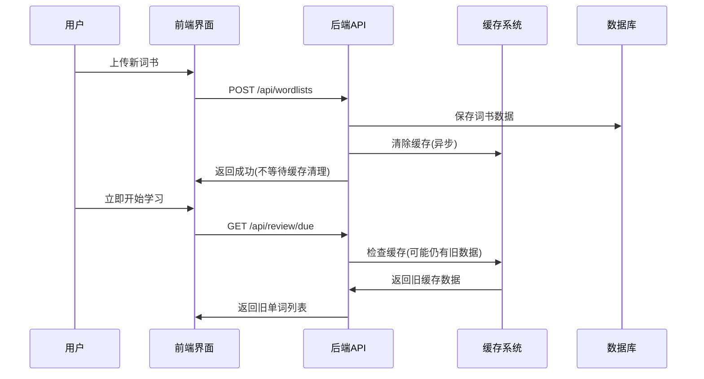
```mermaid
sequenceDiagram
    participant User as 用户
    participant UI as 前端界面
    participant API as 后端API
    participant Cache as 缓存系统
    participant DB as 数据库
    
    User->>UI: 上传新词书
    UI->>API: POST /api/wordlists
    API->>DB: 保存词书数据
    API->>Cache: 清除缓存(异步)
    API->>UI: 返回成功(不等待缓存清理)
    User->>UI: 立即开始学习
    UI->>API: GET /api/review/due
    API->>Cache: 检查缓存(可能仍有旧数据)
    Cache->>API: 返回旧缓存数据
    API->>UI: 返回旧单词列表
```

#### 场景2：不同参数缓存未清理

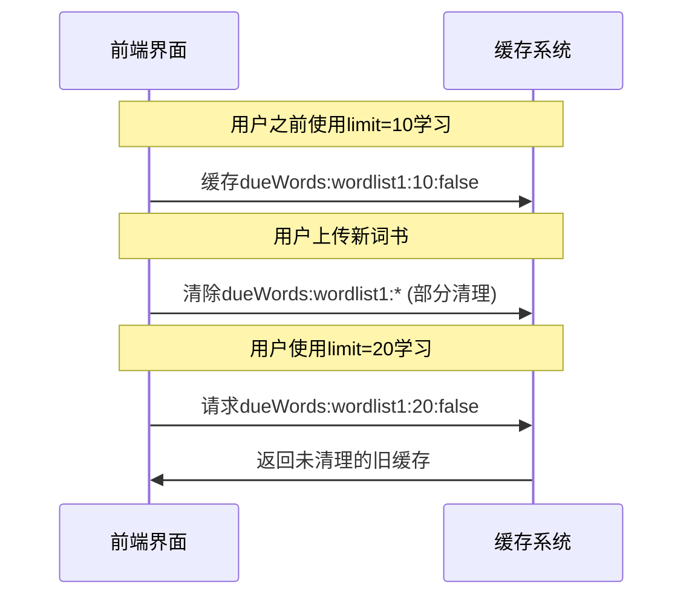
```mermaid
sequenceDiagram
    participant UI as 前端界面
    participant Cache as 缓存系统
    
    Note over UI,Cache: 用户之前使用limit=10学习
    UI->>Cache: 缓存dueWords:wordlist1:10:false
    Note over UI,Cache: 用户上传新词书
    UI->>Cache: 清除dueWords:wordlist1:* (部分清理)
    Note over UI,Cache: 用户使用limit=20学习
    UI->>Cache: 请求dueWords:wordlist1:20:false
    Cache->>UI: 返回未清理的旧缓存
```

#### 场景3：学习进度初始化延迟

```mermaid
sequenceDiagram
    participant User as 用户
    participant API as 后端API
    participant DB as 数据库
    participant Init as 初始化系统
    
    User->>API: 上传新词书
    API->>DB: 保存词书
    API->>Init: 异步初始化学习进度
    User->>API: 开始学习(初始化未完成)
    API->>DB: 查询待复习单词
    DB->>API: 返回空列表(无进度记录)
    API->>User: 显示"没有可学习的单词"
```

### 4. 解决方案

基于前面的深入分析，我们需要从多个层面解决这个问题：

#### 1. 短期解决方案（立即实施）

**a. 在进度更新API中添加缓存清理**

```typescript
// 修改 /api/review/progress/[wordId]/route.ts
import { clearWordlistRelatedCaches } from '@/lib/cacheUtils';

export async function POST(request: NextRequest, { params }: { params: Promise<{ wordId: string }> }) {
  // ... 现有代码 ...
  
  // 更新学习进度
  await db.userWordProgress.update({
    where: { userId_wordId: { userId: user.id, wordId: wordIdNum } },
    data: {
      reviewStage: newReviewStage,
      nextReviewDate: nextReviewDate,
      lastReviewedAt: new Date()
    }
  });
  
  // 新增：清理相关缓存
  try {
    // 获取单词所属的所有词书
    const wordlists = await db.wordlist.findMany({
      where: {
        wordlistEntries: {
          some: { wordId: wordIdNum }
        }
      }
    });
    
    // 清理每个词书的相关缓存
    for (const wordlist of wordlists) {
      await clearWordlistRelatedCaches(wordlist.id);
    }
  } catch (error) {
    console.error('清理缓存失败:', error);
    // 不影响主要流程
  }
  
  return NextResponse.json({...});
}
```

**b. 改进缓存键生成逻辑**

```typescript
// 修改 src/lib/cacheUtils.ts
export function generateCacheKey(prefix: string, params: Record<string, unknown>): string {
  // 标准化参数，处理undefined和null
  const normalizedParams: Record<string, string> = {};
  
  for (const [key, value] of Object.entries(params)) {
    if (value !== undefined && value !== null) {
      normalizedParams[key] = String(value);
    }
  }
  
  // 按键名排序确保一致性
  const sortedParams = Object.keys(normalizedParams)
    .sort()
    .map(key => `${key}:${normalizedParams[key]}`)
    .join('|');
    
  return `${prefix}:${sortedParams}`;
}
```

**c. 修复学习会话状态管理**

```typescript
// 修改 src/hooks/useLearning.ts
const updateWordProgress = useCallback(async (wordId: number, isCorrect: boolean = true) => {
  setIsLoading(true);
  setError(null);

  try {
    const response = await authFetch(`/api/review/progress/${wordId}`, {
      method: 'POST',
      body: JSON.stringify({ isCorrect })
    });

    const data: ReviewProgressResponse = await response.json();

    if (data.success) {
      // 新增：更新本地状态，从队列中移除已完成的单词
      setLearningState(prev => {
        const newWordQueue = [...prev.wordQueue];
        const currentWordIndex = newWordQueue.indexOf(prev.currentWordText || '');
        
        if (currentWordIndex !== -1) {
          newWordQueue.splice(currentWordIndex, 1);
        }
        
        return {
          ...prev,
          wordQueue: newWordQueue,
          currentIndex: Math.max(0, prev.currentIndex - 1)
        };
      });
      
      return data;
    } else {
      setError(data.error || 'Failed to update word progress');
      return null;
    }
  } catch (err) {
    console.error('Error updating word progress:', err);
    setError('Network error while updating word progress');
    return null;
  } finally {
    setIsLoading(false);
  }
}, []);
```

#### 2. 中期解决方案（1-2周内实施）

**a. 实现缓存版本控制**

```typescript
// 新增 src/lib/cacheVersion.ts
class CacheVersionManager {
  private versions = new Map<string, number>();
  
  incrementVersion(namespace: string): void {
    const current = this.versions.get(namespace) || 0;
    this.versions.set(namespace, current + 1);
  }
  
  getVersionedKey(baseKey: string, namespace: string): string {
    const version = this.versions.get(namespace) || 0;
    return `${namespace}:v${version}:${baseKey}`;
  }
}

export const cacheVersionManager = new CacheVersionManager();
```

**b. 修复时间计算精度问题**

```typescript
// 修改 /api/review/due/route.ts
// 使用标准化的日期比较，避免时区问题
function getTodayStart(): Date {
  const now = new Date();
  // 设置为当天的开始时间（00:00:00）
  now.setHours(0, 0, 0, 0);
  return now;
}

// 在查询中使用标准化时间
const whereCondition = {
  userId: user.id,
  nextReviewDate: {
    lte: getTodayStart() // 使用标准化的日期比较
  }
};
```

**c. 添加学习会话状态同步机制**

```typescript
// 新增 src/lib/learningSessionSync.ts
class LearningSessionSync {
  private sessions = new Map<string, Set<string>>();
  
  // 注册学习会话
  registerSession(userId: string, sessionId: string): void {
    if (!this.sessions.has(userId)) {
      this.sessions.set(userId, new Set());
    }
    this.sessions.get(userId)!.add(sessionId);
  }
  
  // 通知其他会话数据已更新
  notifyDataUpdate(userId: string, wordId: number): void {
    const userSessions = this.sessions.get(userId);
    if (userSessions) {
      // 可以通过WebSocket或其他机制通知其他会话
      console.log(`通知用户${userId}的${userSessions.size}个会话数据已更新`);
    }
  }
  
  // 注销会话
  unregisterSession(userId: string, sessionId: string): void {
    const userSessions = this.sessions.get(userId);
    if (userSessions) {
      userSessions.delete(sessionId);
      if (userSessions.size === 0) {
        this.sessions.delete(userId);
      }
    }
  }
}

export const learningSessionSync = new LearningSessionSync();
```

#### 3. 长期解决方案（1个月内实施）

**a. 实现事件驱动的缓存失效**

```typescript
// 新增 src/lib/eventDrivenCache.ts
class EventDrivenCache {
  private eventEmitter = new EventEmitter();
  
  // 订阅数据变更事件
  subscribeToDataChanges(): void {
    this.eventEmitter.on('word-progress-updated', this.handleProgressUpdate.bind(this));
    this.eventEmitter.on('wordlist-updated', this.handleWordlistUpdate.bind(this));
  }
  
  private async handleProgressUpdate(data: { userId: number, wordId: number }): Promise<void> {
    // 自动清理相关缓存
    await this.clearRelatedCaches(data.userId, data.wordId);
    
    // 通知其他学习会话
    learningSessionSync.notifyDataUpdate(data.userId.toString(), data.wordId);
  }
  
  private async clearRelatedCaches(userId: number, wordId: number): Promise<void> {
    // 获取单词所属的所有词书
    const wordlists = await db.wordlist.findMany({
      where: {
        wordlistEntries: {
          some: { wordId }
        }
      }
    });
    
    // 清理每个词书的相关缓存
    for (const wordlist of wordlists) {
      cacheVersionManager.incrementVersion(`wordlist:${wordlist.id}`);
      await clearWordlistRelatedCaches(wordlist.id);
    }
  }
}

export const eventDrivenCache = new EventDrivenCache();
```

**b. 添加数据一致性检查和自动修复**

```typescript
// 新增 src/lib/consistencyChecker.ts
class ConsistencyChecker {
  // 检查待复习单词数据一致性
  async checkDueWordsConsistency(userId: number, wordlistId?: number): Promise<{
    isConsistent: boolean;
    issues: string[];
    fixes: string[];
  }> {
    const issues: string[] = [];
    const fixes: string[] = [];
    
    // 检查数据库中的待复习单词
    const dbDueWords = await this.getDueWordsFromDB(userId, wordlistId);
    
    // 检查缓存中的待复习单词
    const cacheDueWords = await this.getDueWordsFromCache(userId, wordlistId);
    
    // 比较数据一致性
    if (dbDueWords.length !== cacheDueWords.length) {
      issues.push('数据库与缓存中的待复习单词数量不一致');
      fixes.push('清理相关缓存，重新加载数据');
    }
    
    // 检查单词内容是否一致
    const dbWordSet = new Set(dbDueWords.map(w => w.wordText));
    const cacheWordSet = new Set(cacheDueWords.map(w => w.wordText));
    
    const diffInDb = [...dbWordSet].filter(word => !cacheWordSet.has(word));
    const diffInCache = [...cacheWordSet].filter(word => !dbWordSet.has(word));
    
    if (diffInDb.length > 0) {
      issues.push(`数据库中有${diffInDb.length}个单词未在缓存中`);
      fixes.push('更新缓存内容');
    }
    
    if (diffInCache.length > 0) {
      issues.push(`缓存中有${diffInCache.length}个单词已在数据库中更新`);
      fixes.push('清理过期缓存');
    }
    
    return {
      isConsistent: issues.length === 0,
      issues,
      fixes
    };
  }
  
  // 自动修复数据一致性问题
  async fixConsistencyIssues(userId: number, wordlistId?: number): Promise<void> {
    const check = await this.checkDueWordsConsistency(userId, wordlistId);
    
    for (const fix of check.fixes) {
      switch (fix) {
        case '清理相关缓存，重新加载数据':
          await clearWordlistRelatedCaches(wordlistId);
          break;
        case '更新缓存内容':
          await this.refreshCacheContent(userId, wordlistId);
          break;
        case '清理过期缓存':
          await this.clearExpiredCache(userId, wordlistId);
          break;
      }
    }
  }
  
  private async getDueWordsFromDB(userId: number, wordlistId?: number): Promise<Array<{wordText: string}>> {
    // 从数据库获取待复习单词
    const whereCondition: any = {
      userId,
      nextReviewDate: {
        lte: getTodayStart()
      }
    };
    
    if (wordlistId) {
      const wordlistEntries = await db.wordlistEntry.findMany({
        where: { wordlistId },
        select: { wordId: true }
      });
      
      whereCondition.wordId = {
        in: wordlistEntries.map(e => e.wordId)
      };
    }
    
    return await db.userWordProgress.findMany({
      where: whereCondition,
      include: {
        word: {
          select: { wordText: true }
        }
      }
    });
  }
  
  private async getDueWordsFromCache(userId: number, wordlistId?: number): Promise<Array<{wordText: string}>> {
    // 从缓存获取待复习单词
    const cacheKey = generateCacheKey('dueWords', { wordlistId, limit: 50, isNewMode: false });
    return memoryCache.get(cacheKey) || [];
  }
  
  private async refreshCacheContent(userId: number, wordlistId?: number): Promise<void> {
    // 刷新缓存内容
    await clearWordlistRelatedCaches(wordlistId);
    await this.getDueWordsFromDB(userId, wordlistId);
  }
  
  private async clearExpiredCache(userId: number, wordlistId?: number): Promise<void> {
    // 清理过期缓存
    memoryCache.cleanup();
  }
}

export const consistencyChecker = new ConsistencyChecker();
```

**c. 实现分布式缓存和会话管理**

```typescript
// 新增 src/lib/distributedCache.ts
interface DistributedCache {
  get<T>(key: string): Promise<T | null>;
  set<T>(key: string, value: T, ttl?: number): Promise<void>;
  delete(key: string): Promise<void>;
  deletePattern(pattern: string): Promise<number>;
  invalidateTag(tag: string): Promise<void>;
}

class RedisCache implements DistributedCache {
  private client: Redis;
  
  constructor(redisUrl: string) {
    this.client = new Redis(redisUrl);
  }
  
  async get<T>(key: string): Promise<T | null> {
    const value = await this.client.get(key);
    return value ? JSON.parse(value) : null;
  }
  
  async set<T>(key: string, value: T, ttl: number = 300): Promise<void> {
    await this.client.setex(key, ttl, JSON.stringify(value));
  }
  
  async delete(key: string): Promise<void> {
    await this.client.del(key);
  }
  
  async deletePattern(pattern: string): Promise<number> {
    const keys = await this.client.keys(pattern);
    if (keys.length > 0) {
      return await this.client.del(...keys);
    }
    return 0;
  }
  
  async invalidateTag(tag: string): Promise<void> {
    const pattern = `tag:${tag}:*`;
    await this.deletePattern(pattern);
  }
}

// 全局分布式缓存实例
export const distributedCache = new RedisCache(process.env.REDIS_URL || 'redis://localhost:6379');
```

### 5. 实施建议

#### 阶段1：紧急修复（1-2天）

1. **修改进度更新API**：
   - 修改 [`src/app/api/review/progress/[wordId]/route.ts`](src/app/api/review/progress/[wordId]/route.ts)
   - 在更新数据库后同步清理相关缓存
   - 添加错误处理确保缓存清理失败不影响主要流程

2. **改进缓存键生成**：
   - 修改 [`src/lib/cacheUtils.ts`](src/lib/cacheUtils.ts)
   - 标准化参数处理，确保缓存键生成一致性
   - 添加参数验证和规范化

3. **修复学习会话状态管理**：
   - 修改 [`src/hooks/useLearning.ts`](src/hooks/useLearning.ts)
   - 在单词复习完成后正确更新本地状态
   - 从wordQueue中移除已复习的单词

#### 阶段2：架构改进（1周）

1. **实现缓存版本控制**：
   - 创建 [`src/lib/cacheVersion.ts`](src/lib/cacheVersion.ts)
   - 在数据更新时递增版本号
   - 修改缓存键生成策略包含版本信息

2. **修复时间计算精度问题**：
   - 修改 [`src/app/api/review/due/route.ts`](src/app/api/review/due/route.ts)
   - 使用标准化的日期比较函数
   - 处理时区和精度问题

3. **添加学习会话同步机制**：
   - 创建 [`src/lib/learningSessionSync.ts`](src/lib/learningSessionSync.ts)
   - 实现会话注册和通知机制
   - 处理多标签页/设备学习状态同步

#### 阶段3：系统优化（2-3周）

1. **实现事件驱动缓存失效**：
   - 创建 [`src/lib/eventDrivenCache.ts`](src/lib/eventDrivenCache.ts)
   - 订阅数据变更事件自动清理缓存
   - 集成学习会话同步机制

2. **添加数据一致性检查**：
   - 创建 [`src/lib/consistencyChecker.ts`](src/lib/consistencyChecker.ts)
   - 实现自动检测和修复机制
   - 添加定期检查任务

3. **引入分布式缓存**：
   - 创建 [`src/lib/distributedCache.ts`](src/lib/distributedCache.ts)
   - 配置Redis缓存系统
   - 实现缓存的高可用和持久化

### 6. 验证方案

#### 测试用例1：待复习单词逻辑验证

```typescript
// 测试文件: tests/due-words-logic.test.ts
describe('待复习单词逻辑测试', () => {
  test('复习完成后单词应从待复习列表中移除', async () => {
    // 1. 上传测试词书
    const uploadResponse = await fetch('/api/wordlists', {
      method: 'POST',
      body: createFormData('test-wordlist', ['apple', 'banana', 'orange'])
    });
    const { id: wordlistId } = await uploadResponse.json();
    
    // 2. 获取初始待复习单词
    const initialResponse = await fetch(`/api/review/due?wordlistId=${wordlistId}`);
    const initialWords = await initialResponse.json();
    expect(initialWords.words).toContain('apple');
    
    // 3. 复习第一个单词
    const wordId = await getWordIdByText('apple');
    await fetch(`/api/review/progress/${wordId}`, {
      method: 'POST',
      body: JSON.stringify({ isCorrect: true })
    });
    
    // 4. 再次获取待复习单词，验证apple已不在列表中
    const updatedResponse = await fetch(`/api/review/due?wordlistId=${wordlistId}`);
    const updatedWords = await updatedResponse.json();
    expect(updatedWords.words).not.toContain('apple');
  });
});
```

#### 测试用例2：缓存一致性验证

```typescript
test('单词复习后缓存应同步更新', async () => {
  // 1. 获取初始待复习单词（建立缓存）
  const initialResponse = await fetch('/api/review/due?wordlistId=test');
  const initialWords = await initialResponse.json();
  
  // 2. 复习一个单词
  const wordId = await getWordIdByText(initialWords.words[0]);
  await fetch(`/api/review/progress/${wordId}`, {
    method: 'POST',
    body: JSON.stringify({ isCorrect: true })
  });
  
  // 3. 再次获取待复习单词，应返回更新后的数据
  const updatedResponse = await fetch('/api/review/due?wordlistId=test`);
  const updatedWords = await updatedResponse.json();
  
  // 4. 验证缓存已更新
  expect(updatedWords.words).not.toContain(initialWords.words[0]);
  expect(updatedResponse.headers.get('x-cache-status')).toBe('miss');
});
```

#### 测试用例3：学习会话状态同步验证

```typescript
test('学习会话状态应与服务器状态同步', async () => {
  // 1. 开始学习会话
  const { startLearningSession, learningState } = renderHook(() => useLearning());
  await act(async () => {
    await startLearningSession('review', 1);
  });
  
  // 2. 记录初始状态
  const initialWordCount = learningState.wordQueue.length;
  const initialCurrentWord = learningState.currentWordText;
  
  // 3. 复习当前单词
  const wordId = await getWordIdByText(initialCurrentWord);
  await act(async () => {
    await updateWordProgress(wordId, true);
  });
  
  // 4. 验证本地状态已更新
  expect(learningState.wordQueue.length).toBe(initialWordCount - 1);
  expect(learningState.wordQueue).not.toContain(initialCurrentWord);
});
```

#### 测试用例4：时间计算精度验证

```typescript
test('时间计算应正确处理边界情况', async () => {
  // 1. 创建一个今天应该复习的单词
  const today = new Date();
  today.setHours(0, 0, 0, 0);
  
  await db.userWordProgress.update({
    where: { userId_wordId: { userId: testUserId, wordId: testWordId } },
    data: { nextReviewDate: today }
  });
  
  // 2. 获取待复习单词
  const response = await fetch('/api/review/due');
  const words = await response.json();
  
  // 3. 验证单词出现在待复习列表中
  expect(words.words).toContain('testWord');
  
  // 4. 将复习日期设为明天
  const tomorrow = new Date(today);
  tomorrow.setDate(tomorrow.getDate() + 1);
  
  await db.userWordProgress.update({
    where: { userId_wordId: { userId: testUserId, wordId: testWordId } },
    data: { nextReviewDate: tomorrow }
  });
  
  // 5. 再次获取待复习单词
  const updatedResponse = await fetch('/api/review/due');
  const updatedWords = await updatedResponse.json();
  
  // 6. 验证单词不在待复习列表中
  expect(updatedWords.words).not.toContain('testWord');
});
```

#### 手动验证步骤

1. **重现待复习单词bug**：
   - 登录系统
   - 开始学习一个词书
   - 复习几个单词
   - 刷新页面或重新进入学习界面
   - 观察已复习的单词是否仍显示在待复习列表中

2. **验证缓存清理修复**：
   - 执行相同操作
   - 确认复习完成后单词不再显示在待复习列表中
   - 测试不同limit参数的学习模式
   - 验证快速连续操作不会出现问题

3. **验证学习会话状态同步**：
   - 在两个标签页中同时学习同一词书
   - 在一个标签页中复习单词
   - 切换到另一个标签页，验证状态是否同步更新

4. **性能验证**：
   - 测量复习进度更新响应时间
   - 监控缓存命中率和清理效果
   - 检查内存使用情况和泄漏

## 总结

通过深入分析待复习单词逻辑，我们发现了以下关键问题：

1. **根本原因**：待复习单词基于 [`nextReviewDate`](src/app/api/review/due/route.ts:37) 字段计算，但复习完成后缓存未及时清理，导致前端仍显示旧的待复习单词列表。

2. **主要问题点**：
   - 复习完成后缓存未清理是主要问题
   - 学习会话状态与服务器状态不同步
   - 缓存键生成不一致导致清理失败
   - 时间计算可能存在精度问题

3. **解决方案层次**：
   - **短期**：在进度更新API中添加缓存清理，修复学习会话状态管理
   - **中期**：实现缓存版本控制，修复时间计算精度问题，添加会话同步机制
   - **长期**：实现事件驱动缓存失效，添加数据一致性检查，引入分布式缓存

4. **关键发现**：
   - 待复习单词计算逻辑本身是正确的，问题出在缓存管理上
   - 单词复习完成后需要同步清理多个相关缓存
   - 学习会话的本地状态需要与服务器状态保持一致
   - 时间计算需要标准化处理以避免边界情况

通过以上分析和解决方案，可以有效解决待复习单词逻辑中的各种问题，确保数据一致性和用户体验。修复后的系统将能够正确处理单词复习流程，避免已复习单词重复显示的问题，提升整体学习体验。